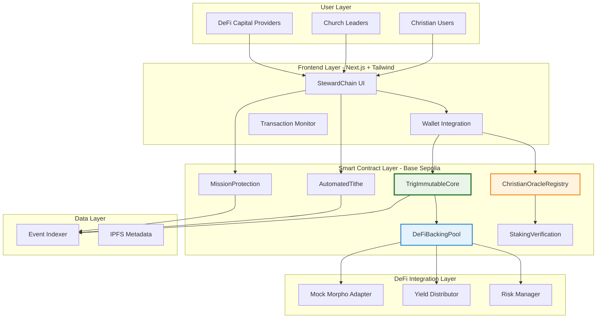

# Trig Protocol + StewardChain: 72-Hour Hackathon Architecture

**Project Duration**: 72 hours
**Target**: Base Sepolia Testnet
**Demo Focus**: Christian financial stewardship with DeFi backing

---

## 🎯 System Overview



---

## 📦 Smart Contract Architecture

### **1. Core Protocol Layer**

#### **TrigImmutableCore.sol**
```solidity
// Minimal but complete core with 3 condition types
- Time-based conditions (for mission duration, vesting)
- Token balance conditions (for tithe triggers)
- Multisig conditions (for community verification)
```

**Key Features**:
- ✅ Condition creation with unique IDs
- ✅ Deterministic execution logic
- ✅ Cross-chain ready (LayerZero OApp)
- ✅ Event emission for indexing

#### **TrigCrossChainState.sol**
```solidity
// Cross-chain state management (structure only, not deployed multi-chain)
- State root storage
- Merkle proof verification
- LayerZero message handling
```

### **2. Christian Application Layer**

#### **ChristianOracleRegistry.sol**
```solidity
// Staking-based verification system
struct VerifiedChurch {
    address churchAddress;
    string churchName;
    string denomination;
    uint256 verificationDate;
    address[] verifiedLeaders;
    uint256 stakeAmount;
    bool isActive;
}

struct ChurchLeader {
    address leaderAddress;
    string leaderName;
    string role;
    uint256 stakeAmount;
    uint256 verificationPower;
    bool isActive;
}

// Staking requirements for verification
uint256 public constant MIN_CHURCH_STAKE = 1 ether;
uint256 public constant MIN_LEADER_STAKE = 0.1 ether;
uint256 public constant SLASHING_PERCENTAGE = 10; // 10% slash for false verification
```

**Key Features**:
- ✅ Church registration with staking
- ✅ Leader verification with economic security
- ✅ Slashing mechanism for false verification
- ✅ Tiered verification power based on stake

#### **AutomatedTithe.sol**
```solidity
// Income-based automated tithing
struct TitheCommitment {
    address believer;
    address church;
    uint256 incomeThreshold;
    uint256 tithePercentage; // 10% = 1000 basis points
    uint256 offeringPercentage; // Additional offerings
    bool active;
    uint256 createdAt;
    uint256 totalTithed;
}

// Integration with DeFi backing
function createTitheCommitment(
    address church,
    uint256 incomeThreshold,
    uint256 tithePercentage,
    uint256 offeringPercentage
) external returns (uint256 commitmentId);

function executeTithe(
    uint256 commitmentId,
    uint256 currentIncome,
    bytes calldata proof
) external;
```

**Key Features**:
- ✅ Automated percentage-based giving
- ✅ Multiple recipient support (church + missions)
- ✅ Income verification (simplified for hackathon)
- ✅ Complete giving history

#### **MissionProtection.sol**
```solidity
// Mission trip insurance
struct MissionPolicy {
    address missionary;
    string destination;
    uint256 startDate;
    uint256 endDate;
    uint256 coverageAmount;
    uint256 premium;
    uint256 policyConditionId; // Links to TrigCore condition
    bool active;
}

function createMissionPolicy(
    string memory destination,
    uint256 startDate,
    uint256 endDate,
    uint256 coverageAmount
) external payable returns (uint256 policyId);

function claimPolicy(
    uint256 policyId,
    bytes calldata proof
) external;
```

**Key Features**:
- ✅ Time-based coverage
- ✅ Automated payout on trip completion
- ✅ DeFi backing integration
- ✅ Multi-signature claim approval

### **3. DeFi Integration Layer**

#### **DeFiBackingPool.sol**
```solidity
// Hybrid DeFi integration with real deposits
struct BackingPool {
    address protocol; // Mock Morpho adapter
    address asset;    // USDC testnet
    uint256 totalBacking;
    uint256 activeCoverage;
    uint256 utilizationRate;
    uint256 baseYield;
    bool isActive;
}

// Real deposit/withdraw functionality
function addBacking(
    uint256 amount,
    uint256 lockPeriod
) external returns (uint256 positionId);

function withdrawBacking(uint256 positionId) external;

// Simplified yield distribution
function distributeYield() external;
```

**Key Features**:
- ✅ Real deposit to mock Morpho
- ✅ Simplified yield calculation
- ✅ Risk management parameters
- ✅ Emergency withdrawal

#### **StakingVerification.sol**
```solidity
// Staking for verification power
struct VerifierStake {
    address verifier;
    uint256 amount;
    uint256 stakedAt;
    uint256 lockUntil;
    uint256 verificationCount;
    bool isSlashed;
}

function stakeForVerification(
    uint256 amount,
    uint256 lockPeriod
) external;

function slashVerifier(
    address verifier,
    string memory reason
) external onlyGovernance;
```

---

## 🎨 Frontend Architecture

### **Technology Stack**
```typescript
// Core Framework
- Next.js 14 (App Router)
- TypeScript
- Tailwind CSS
- shadcn/ui components

// Web3 Integration
- wagmi + viem
- RainbowKit for wallet connection
- ethers v6 for contract interaction

// State Management
- React Context + hooks
- TanStack Query for data fetching

// UI Components
- Radix UI primitives
- Lucide icons
- Framer Motion for animations
```

### **Key Pages**

#### **1. Dashboard** (`/dashboard`)
```typescript
// Overview of user's commitments and policies
- Active tithe commitments
- Mission protection policies
- Verification tasks (for leaders)
- Giving history
- Backing pool positions (for DeFi users)
```

#### **2. Tithe Setup** (`/tithe/create`)
```typescript
// Create automated tithe commitment
- Church selection/search
- Income threshold input
- Percentage configuration
- Preview and confirm
```

#### **3. Mission Protection** (`/mission/create`)
```typescript
// Purchase mission trip insurance
- Destination input
- Date range selection
- Coverage amount
- Premium calculation
- Payment flow
```

#### **4. Church Portal** (`/church`)
```typescript
// For verified church leaders
- Register church
- View received tithes
- Verify other leaders
- Manage verification tasks
```

#### **5. DeFi Backing** (`/backing`)
```typescript
// For capital providers
- View pool statistics
- Add backing position
- View yield history
- Withdraw backing
```

---

## 📊 Database & Indexing

### **Event Indexing**
```typescript
// Use The Graph protocol or simple REST API
interface IndexedEvent {
  // Condition events
  ConditionCreated: { conditionId, creator, type, timestamp }
  ConditionExecuted: { conditionId, executor, timestamp }
  
  // Tithe events
  TitheCommitmentCreated: { commitmentId, believer, church }
  TitheExecuted: { commitmentId, amount, timestamp }
  
  // Mission events
  MissionPolicyCreated: { policyId, missionary, destination }
  MissionClaimed: { policyId, amount, timestamp }
  
  // Verification events
  ChurchRegistered: { churchAddress, name }
  LeaderVerified: { leaderAddress, church }
  VerificationCompleted: { requestId, verifier }
}
```

### **Metadata Storage**
```typescript
// IPFS for church information and testimonies
interface ChurchMetadata {
  name: string;
  denomination: string;
  location: string;
  website: string;
  description: string;
  logo: string; // IPFS hash
  socialLinks: {
    twitter?: string;
    instagram?: string;
    facebook?: string;
  }
}

interface TestimonyMetadata {
  believer: string;
  testimony: string;
  date: number;
  witnesses: string[];
  evidenceHashes: string[];
}
```

---

## 🧪 Testing Strategy

### **Smart Contract Tests** (Foundry)
```solidity
// 50% of development time allocated to testing

// Unit Tests
- TrigImmutableCore.t.sol
  - Condition creation
  - Condition execution
  - Edge cases
  
- AutomatedTithe.t.sol
  - Commitment creation
  - Tithe execution
  - Multiple recipients
  
- MissionProtection.t.sol
  - Policy creation
  - Claim processing
  - Time-based logic
  
- ChristianOracleRegistry.t.sol
  - Church registration
  - Leader verification
  - Staking mechanics
  - Slashing logic

// Integration Tests
- End-to-end tithe flow
- Mission protection complete cycle
- DeFi backing integration
- Cross-contract interactions
```

### **Frontend Tests**
```typescript
// Component Tests (Vitest + Testing Library)
- Wallet connection flow
- Form validation
- Transaction handling
- Error states

// E2E Tests (Playwright - if time permits)
- Complete tithe setup
- Mission protection purchase
- Church registration
```

---

## 🚀 Development Timeline

### **Phase 1: Foundation (Hours 0-6)**
```bash
Hour 0-1: Project Setup
- Initialize hardhat project
- Install dependencies
- Configure Base Sepolia
- Set up Next.js frontend

Hour 1-3: Core Contracts
- TrigImmutableCore skeleton
- Basic condition types
- Event emission

Hour 3-6: Testing Infrastructure
- Foundry test setup
- First unit tests
- Mock contracts
```

### **Phase 2: Core Protocol (Hours 6-24)**
```bash
Hour 6-12: Complete Core
- Time-based conditions
- Token balance conditions
- Multisig conditions
- LayerZero OApp structure

Hour 12-18: Core Testing
- Comprehensive unit tests
- Edge case coverage
- Gas optimization

Hour 18-24: Deployment Scripts
- Deploy to Base Sepolia
- Contract verification
- Initial integration testing
```

### **Phase 3: Christian Applications (Hours 24-48)**
```bash
Hour 24-30: Oracle Registry
- Church registration
- Leader verification
- Staking mechanics

Hour 30-36: Automated Tithe
- Commitment creation
- Execution logic
- Multiple recipients

Hour 36-42: Mission Protection
- Policy creation
- Time-based coverage
- Claim processing

Hour 42-48: Application Testing
- Unit tests for each contract
- Integration tests
- Staking/slashing tests
```

### **Phase 4: DeFi & Frontend (Hours 48-60)**
```bash
Hour 48-52: DeFi Integration
- Mock Morpho adapter
- Backing pool contract
- Simplified yield distribution

Hour 52-56: Frontend Core
- Next.js setup with shadcn
- Wallet integration
- Basic layouts

Hour 56-60: UI Components
- Tithe creation form
- Mission protection form
- Dashboard components
```

### **Phase 5: Polish & Demo (Hours 60-72)**
```bash
Hour 60-64: Frontend Completion
- Church portal
- DeFi backing UI
- Transaction monitoring

Hour 64-68: Integration & Testing
- End-to-end testing
- Bug fixes
- UI polish

Hour 68-70: Demo Preparation
- Demo script
- Test data seeding
- Video recording

Hour 70-72: Documentation & Final
- README
- Architecture docs
- Presentation slides
```

---

## ⚠️ Risk Mitigation

### **Technical Risks**

| Risk | Probability | Impact | Mitigation |
|------|-------------|--------|------------|
| Staking logic bugs | Medium | High | Extensive unit tests, simplified slashing |
| DeFi integration issues | Medium | Medium | Mock adapter with fallback to pure mock |
| Time-based condition failure | Low | High | Thorough testing with block manipulation |
| Frontend wallet bugs | Medium | Medium | Use battle-tested RainbowKit |
| Testnet instability | Low | High | Local fork testing as backup |

### **Scope Risks**

| Risk | Mitigation |
|------|------------|
| Feature creep | Strict adherence to 72-hour plan |
| UI complexity | Use pre-built shadcn components |
| Testing insufficient | 50/50 time allocation enforced |
| Demo failures | Multiple practice runs, fallback recordings |

---

## 🎯 Success Criteria

### **Must-Have (Critical for Demo)**
- ✅ TrigCore deployed with 3 condition types
- ✅ Automated tithe system working end-to-end
- ✅ Mission protection working end-to-end
- ✅ Church registration with staking
- ✅ Working frontend with wallet integration
- ✅ DeFi backing pool operational

### **Should-Have (Important but not critical)**
- ✅ Comprehensive test coverage (>70%)
- ✅ Leader verification with slashing
- ✅ Polished UI with smooth UX
- ✅ Event indexing for history
- ✅ Multiple churches in demo data

### **Nice-to-Have (Time permitting)**
- Prayer commitment system
- Advanced yield distribution
- Mobile responsive design
- Cross-chain demo video
- Advanced analytics dashboard

---

## 📈 Post-Hackathon Expansion Path

### **Immediate (Week 1-2)**
- Add remaining condition types
- Full DeFi yield optimization
- Enhanced security audit

### **Short-term (Month 1-3)**
- Multi-chain deployment
- Production frontend
- Professional audit
- Community testing

### **Long-term (Month 3-6)**
- Token launch
- Real DeFi protocol integration
- Mobile app
- Institutional partnerships

---

**Architecture Status**: ✅ Approved and Ready for Development
**Next Step**: Begin Phase 1 - Foundation Setup

