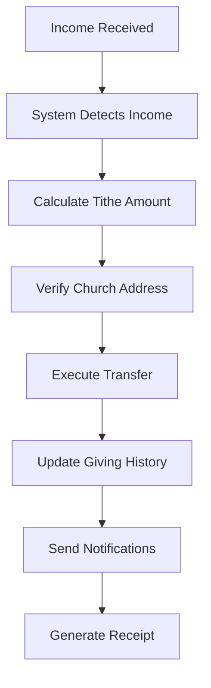
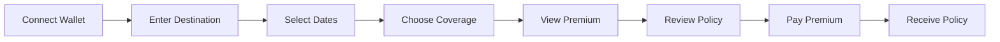
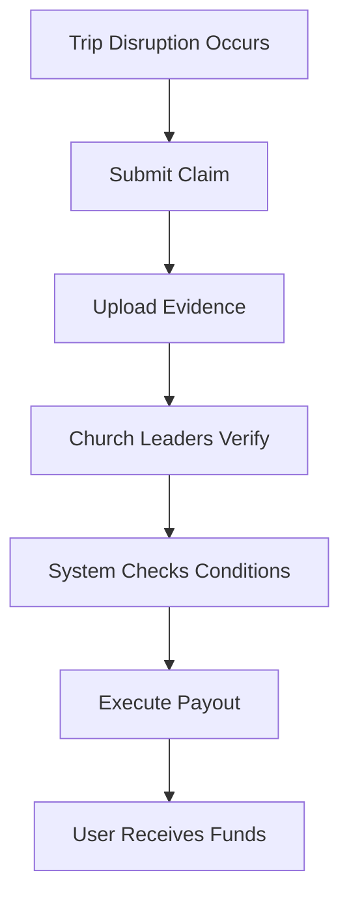
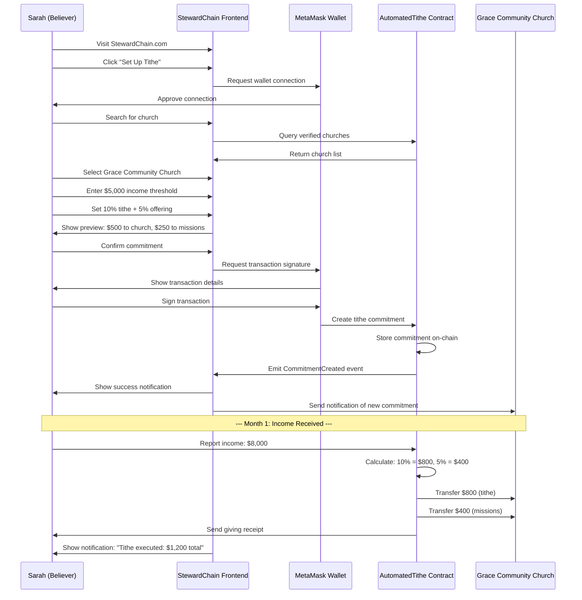
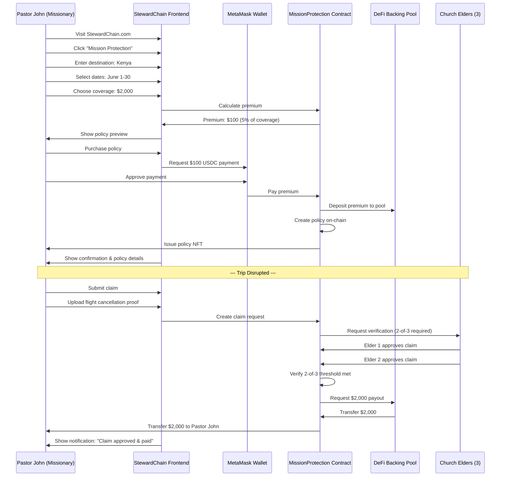
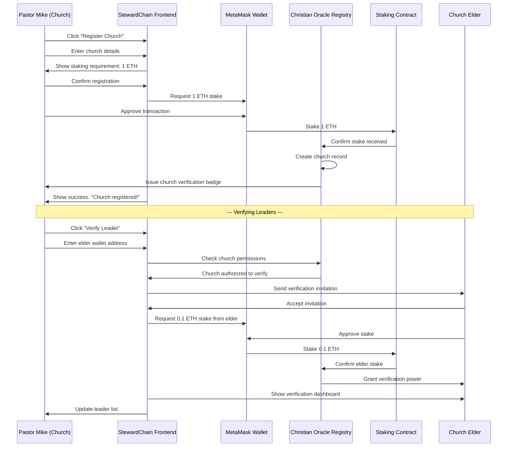

# 🚀 Trig Protocol + StewardChain: Team Briefing & User Stories

**Project**: Christian Financial Stewardship Platform on Blockchain
**Duration**: 72-hour Hackathon
**Team Size**: 3 members (2 developers + 1 non-technical)
**Target**: Working demo with real-world use cases

---

## 🎯 **What Are We Building? (30-Second Pitch)**

We're building **StewardChain** - a blockchain platform that helps Christians practice faithful financial stewardship through automated giving, mission trip protection, and transparent church accountability. It's powered by **Trig Protocol**, which enables smart contracts that automatically execute when real-world conditions are met.

**Think of it as**: "If This, Then That" (IFTTT) for Christian giving and insurance, backed by real money from DeFi protocols.

---

## 👥 **Team Roles & Responsibilities**

### **Developer 1 (Smart Contract Focus)**
**Primary**: Backend blockchain development
- Build core Trig Protocol contracts
- Implement Christian oracle system
- Create DeFi backing integration
- Write comprehensive tests
- Deploy to Base testnet

**Skills Needed**: Solidity, Hardhat, Testing

### **Developer 2 (Frontend + Integration Focus)**
**Primary**: User interface and integration
- Build Next.js frontend with wallet connection
- Create forms for tithe and mission protection
- Integrate smart contracts with UI
- Handle transaction flows
- Design responsive layouts

**Skills Needed**: React/Next.js, TypeScript, Web3 (wagmi/viem)

### **Non-Technical Team Member (Product + Demo Focus)**
**Primary**: User experience and storytelling
- Define user flows and requirements
- Create demo script and scenarios
- Test user experience
- Prepare presentation materials
- Record demo video
- Manage documentation

**Skills Needed**: Communication, storytelling, user empathy

---

## 📖 **Core User Stories**

### **Epic 1: Automated Tithing System**

#### **User Story 1.1: Create Tithe Commitment**
```
AS A Christian believer
I WANT TO set up automatic tithing to my church
SO THAT I can practice consistent biblical giving without manual effort
```

**Acceptance Criteria**:
- ✅ User can connect their wallet
- ✅ User can select a verified church from a list
- ✅ User can set income threshold (e.g., "$5,000/month")
- ✅ User can set tithe percentage (e.g., "10%")
- ✅ User can add additional offering percentage (e.g., "5% to missions")
- ✅ User can preview the commitment before confirming
- ✅ Transaction is recorded on blockchain
- ✅ User receives confirmation

**User Journey**:


**Example Scenario**:
> Sarah is a software engineer earning $8,000/month. She wants to tithe 10% to her local church and give an additional 5% to missions. She sets up her commitment once, and every month when her income comes in, the system automatically transfers $800 to her church and $400 to missions.

#### **User Story 1.2: Execute Tithe Payment**
```
AS A believer with a tithe commitment
I WANT my tithe to execute automatically when I receive income
SO THAT I don't forget to give and practice faithful stewardship
```

**Acceptance Criteria**:
- ✅ System monitors when user receives income
- ✅ Calculates correct tithe amount based on percentage
- ✅ Splits payment between church and missions if specified
- ✅ Executes transfer automatically
- ✅ Records transaction in giving history
- ✅ Sends notification to user and church
- ✅ Generates giving receipt

**User Journey**:


**Example Scenario**:
> Sarah receives her monthly salary on the 1st of each month. The system automatically detects this, calculates her 10% tithe ($800) and 5% offering ($400), and transfers the funds to her church and missions fund. She receives a notification with her giving receipt for tax purposes.

#### **User Story 1.3: View Giving History**
```
AS A believer who tithes
I WANT TO see my complete giving history
SO THAT I can track my stewardship and have records for tax purposes
```

**Acceptance Criteria**:
- ✅ User can view all past tithe payments
- ✅ See amounts, dates, and recipients
- ✅ View running totals (yearly, lifetime)
- ✅ Export giving statements
- ✅ See blockchain proof of each payment

**Example Scenario**:
> At tax time, Sarah needs her annual giving statement. She logs into StewardChain, views her complete history, and exports a report showing she gave $9,600 to church and $4,800 to missions in 2024.

---

### **Epic 2: Mission Trip Protection**

#### **User Story 2.1: Purchase Mission Protection**
```
AS A missionary preparing for international service
I WANT TO purchase insurance for my mission trip
SO THAT I'm protected if the trip is disrupted or cancelled
```

**Acceptance Criteria**:
- ✅ User can enter trip destination
- ✅ User can select trip dates
- ✅ User can choose coverage amount
- ✅ System calculates premium automatically
- ✅ User can review policy details
- ✅ User can pay premium and receive policy
- ✅ Policy is recorded on blockchain

**User Journey**:


**Example Scenario**:
> Pastor John is leading a mission trip to Kenya for 30 days. He purchases a $2,000 coverage policy for a $100 premium. If the trip is cancelled due to political unrest or his flight is significantly delayed, he automatically receives the payout.

#### **User Story 2.2: File Mission Trip Claim**
```
AS A missionary with trip protection
I WANT TO file a claim if my trip is disrupted
SO THAT I receive the protection payout automatically
```

**Acceptance Criteria**:
- ✅ User can submit claim with evidence
- ✅ System verifies the disruption occurred
- ✅ Church leaders verify the claim (2-of-3)
- ✅ Payout executes automatically upon verification
- ✅ User receives funds within 24 hours
- ✅ Transaction is recorded on blockchain

**User Journey**:


**Example Scenario**:
> Pastor John's flight to Kenya is cancelled due to political unrest. He submits a claim with his cancelled flight confirmation. Three church elders verify the situation. The smart contract automatically transfers $2,000 to Pastor John's wallet within 24 hours.

---

### **Epic 3: Church Leadership Portal**

#### **User Story 3.1: Register Church**
```
AS A church leader
I WANT TO register my church on the platform
SO THAT members can tithe to us and we can verify other leaders
```

**Acceptance Criteria**:
- ✅ Leader can enter church details (name, location, denomination)
- ✅ Leader must stake 1 ETH to register
- ✅ Church information is stored on blockchain
- ✅ Church receives unique identifier
- ✅ Church appears in member search results

**Example Scenario**:
> Pastor Mike wants his church on StewardChain. He connects his wallet, enters "Grace Community Church, Dallas, TX", stakes 1 ETH as security deposit, and completes registration. Now his church members can set up automatic tithing to the church.

#### **User Story 3.2: Verify Church Leader**
```
AS A verified church
I WANT TO verify other church leaders
SO THAT they can participate in claim verification
```

**Acceptance Criteria**:
- ✅ Church can nominate leaders for verification
- ✅ Leader must stake 0.1 ETH to be verified
- ✅ Leader receives verification credentials
- ✅ Leader can now verify claims and testimonies
- ✅ Leader's verification power is based on stake amount

**Example Scenario**:
> Grace Community Church verifies three of its elders. Each elder stakes 0.1 ETH. Now these elders can verify mission trip claims, tithe commitments, and other activities, providing accountability to the system.

#### **User Story 3.3: View Received Tithes**
```
AS A church leader
I WANT TO see all tithes received by our church
SO THAT we can track donations and thank our members
```

**Acceptance Criteria**:
- ✅ Church can view all received tithes
- ✅ See donor information (with privacy options)
- ✅ View amounts and dates
- ✅ Export financial reports
- ✅ See total received (monthly, yearly)

**Example Scenario**:
> At the end of the month, Pastor Mike logs in and sees that 25 members gave a total of $15,000 in tithes. He can see individual contributions (if members haven't chosen to remain anonymous) and send thank-you messages.

---

### **Epic 4: DeFi Capital Backing**

#### **User Story 4.1: Provide Backing Capital**
```
AS A DeFi user with idle USDC
I WANT TO back insurance policies to earn yield
SO THAT my capital is productive and I earn higher returns
```

**Acceptance Criteria**:
- ✅ User can view available backing pools
- ✅ User can see current APY rates
- ✅ User can deposit USDC into pool
- ✅ User can choose lock period
- ✅ User receives position confirmation
- ✅ User can track yield earnings

**User Journey**:


**Example Scenario**:
> Maria has $50,000 USDC sitting idle in Morpho earning 5% APY. She moves it to StewardChain's backing pool where she earns 12% APY (5% base + 7% from insurance premiums). Her capital backs mission trip insurance policies.

#### **User Story 4.2: Withdraw Backing**
```
AS A capital provider
I WANT TO withdraw my backing when the lock period ends
SO THAT I can access my capital and earned yield
```

**Acceptance Criteria**:
- ✅ User can view their positions
- ✅ System shows lock period remaining
- ✅ User can withdraw after lock expires
- ✅ Withdrawal includes principal + yield
- ✅ Transaction completes within minutes
- ✅ Position is marked as closed

**Example Scenario**:
> After 6 months, Maria's lock period expires. She logs in, sees she earned $6,000 in yield (12% APY), and withdraws her $56,000 total back to her wallet.

---

## 🔄 **End-to-End Process Flows**

### **Process 1: Complete Tithe Flow**



### **Process 2: Complete Mission Protection Flow**



### **Process 3: Church Verification Flow**



---

## 🎬 **Demo Script (5 Minutes)**

### **Minute 1: Introduction & Problem**
**Speaker**: Non-Technical Team Member

> "Hi, I'm [Name] and we're presenting StewardChain. 
> 
> Did you know that Christians give over $50 billion annually to churches, but the process is manual, inconsistent, and lacks transparency? Mission trips worth millions of dollars have no protection when they're disrupted. And there's $16 billion of idle capital in DeFi earning minimal returns.
>
> StewardChain solves all three problems at once."

### **Minute 2: Solution Overview**
**Speaker**: Developer 1

> "We built two things: Trig Protocol - a blockchain infrastructure for parametric conditions, and StewardChain - Christian applications on top.
>
> Let me show you our architecture..."
> 
> [Show architecture diagram]
>
> "The core innovation is using DeFi idle capital to back real insurance, creating a win-win for everyone."

### **Minute 3: Live Demo - Automated Tithe**
**Speaker**: Developer 2

> "Let me show you Sarah setting up her tithe. She connects her wallet...
> 
> [Live action on screen]
> 
> She selects her church... enters her income threshold... sets 10% for tithe and 5% for missions...
>
> And boom - one transaction, her commitment is on the blockchain. Now every month, when she receives income, the system automatically tithes for her.
>
> [Show execution happening]
>
> Here's her giving history - fully transparent, immutable, and tax-ready."

### **Minute 4: Live Demo - Mission Protection**
**Speaker**: Developer 2

> "Now let's buy mission trip insurance. Pastor John enters his destination Kenya, dates June 1-30, wants $2,000 coverage...
>
> [Live action on screen]
>
> System calculates a $100 premium - way cheaper than traditional insurance because we're using DeFi backing.
>
> He pays, gets his policy instantly.
>
> [Show claim submission]
>
> Trip gets disrupted - he submits claim, church elders verify, and in 24 hours, $2,000 hits his wallet automatically. No paperwork, no waiting weeks."

### **Minute 5: Impact & Vision**
**Speaker**: Non-Technical Team Member

> "Let me show you the impact:
>
> [Show statistics slide]
>
> - Churches: Predictable income, full transparency
> - Believers: Effortless giving, complete history
> - Missionaries: Protection without bureaucracy
> - DeFi users: Higher yields backing real-world impact
>
> We built this in 72 hours, but the vision is massive - $50B+ market opportunity.
>
> StewardChain proves that blockchain can serve faith, not replace it. Thank you!"

---

## 📊 **Team Coordination Plan**

### **Day 1 (Hours 0-24): Foundation**

**Developer 1 Tasks**:
- Hours 0-6: Set up Hardhat, deploy core contracts
- Hours 6-12: Complete TrigImmutableCore
- Hours 12-18: Testing and optimization
- Hours 18-24: Deploy to testnet

**Developer 2 Tasks**:
- Hours 0-6: Set up Next.js, configure wagmi
- Hours 6-12: Build layout and wallet connection
- Hours 12-18: Create contract hooks
- Hours 18-24: Build dashboard page

**Non-Technical Member Tasks**:
- Hours 0-6: Review user stories, create scenarios
- Hours 6-12: Test developer 2's UI flows
- Hours 12-18: Draft demo script v1
- Hours 18-24: Create test data and personas

**Daily Sync**: End of Day 1 (30 min)
- Review what's completed
- Identify blockers
- Adjust Day 2 plan

### **Day 2 (Hours 24-48): Core Features**

**Developer 1 Tasks**:
- Hours 24-30: Christian Oracle Registry
- Hours 30-36: Automated Tithe contract
- Hours 36-42: Mission Protection contract
- Hours 42-48: Deploy and test all contracts

**Developer 2 Tasks**:
- Hours 24-30: Build tithe creation form
- Hours 30-36: Build mission protection form
- Hours 36-42: Integrate with smart contracts
- Hours 42-48: Add transaction monitoring

**Non-Technical Member Tasks**:
- Hours 24-30: Test tithe creation flow
- Hours 30-36: Test mission protection flow
- Hours 36-42: Document all user flows
- Hours 42-48: Create presentation slides

**Daily Sync**: End of Day 2 (30 min)
- Demo features to each other
- Identify UX issues
- Plan Day 3 polish

### **Day 3 (Hours 48-72): Polish & Demo**

**Developer 1 Tasks**:
- Hours 48-54: DeFi backing integration
- Hours 54-60: Bug fixes and testing
- Hours 60-66: Final deployment
- Hours 66-72: Support demo preparation

**Developer 2 Tasks**:
- Hours 48-54: Complete all UI pages
- Hours 54-60: Polish and responsive design
- Hours 60-66: Bug fixes and testing
- Hours 66-72: Support demo preparation

**Non-Technical Member Tasks**:
- Hours 48-54: Finalize demo script
- Hours 54-60: Practice demo (multiple times)
- Hours 60-66: Record demo video
- Hours 66-72: Create final presentation

**Final Sync**: Hour 66 (1 hour)
- Complete practice run
- Identify any last issues
- Assign final tasks

---

## 🎯 **Success Criteria**

### **For Judges**
✅ We can execute a complete tithe setup and payment live
✅ We can show mission protection purchase and claim
✅ We can demonstrate DeFi backing working
✅ All transactions are on-chain and verifiable
✅ UI is polished and professional

### **For Team**
✅ All critical path tasks completed
✅ No major bugs in demo scenarios
✅ Everyone can explain their part
✅ Demo stays under 5 minutes
✅ Presentation is clear and compelling

### **For Future**
✅ Code is documented and maintainable
✅ Architecture can scale post-hackathon
✅ Clear path to production
✅ Investor-ready materials

---

## 📚 **Resources & Links**

### **For Developers**
- Architecture: `/ARCHITECTURE.md`
- Task Tracker: `/TASK_TRACKER.md`
- Base Sepolia Faucet: https://faucet.quicknode.com/base/sepolia
- LayerZero Docs: https://docs.layerzero.network
- OpenZeppelin Contracts: https://docs.openzeppelin.com
- wagmi Documentation: https://wagmi.sh
- shadcn/ui Components: https://ui.shadcn.com

### **For Non-Technical Member**
- User stories (this document)
- Christian use case examples
- Demo script template (above)
- Presentation outline (above)

### **Communication**
- Daily sync times: 8am, 2pm, 8pm (or adjust for team)
- Emergency blockers: Immediate Slack/Discord
- Progress updates: Async in shared doc
- Questions: Ask early and often!

---

## 💡 **Key Messages to Remember**

### **What Makes This Special?**
1. **Real-World Impact**: Helping Christians practice faithful stewardship
2. **Technical Innovation**: DeFi capital backing blockchain insurance
3. **User Experience**: Simple, automatic, transparent
4. **Market Opportunity**: $50B+ Christian giving market
5. **Scalable Architecture**: Built to grow beyond hackathon

### **The "Wow" Moments**
1. **Automatic tithing**: Set it once, forget it, perfect giving history
2. **Instant claims**: 24-hour payout vs weeks with traditional insurance
3. **Community verification**: Church leaders provide accountability
4. **Higher yields**: DeFi users earn more backing real impact
5. **Full transparency**: Every dollar tracked on blockchain

### **The Vision Statement**
> "StewardChain proves that blockchain technology can enhance faith-based giving without replacing the personal relationships that make churches communities. We're not disrupting churches - we're equipping them with 21st-century tools to serve their missions better."

---

## 🚀 **Next Steps**

### **Immediate (Hour 0)**
1. **All team members**: Read this document fully
2. **Developers**: Review `/ARCHITECTURE.md` and `/TASK_TRACKER.md`
3. **Non-technical**: Create detailed demo personas
4. **Everyone**: First team sync to confirm understanding

### **First Deliverables (Hour 6)**
- **Developer 1**: Core contracts deployed to local network
- **Developer 2**: Frontend running with wallet connection
- **Non-technical**: Demo script v1 draft complete

### **First Demo (Hour 24)**
- **Everyone**: Internal demo of current progress
- Tithe flow should be partially working
- UI should have basic layout

### **Final Demo (Hour 72)**
- **Everyone**: Ready to present to judges
- All features working
- Demo video recorded
- Presentation polished

---

## ❓ **FAQ for Team**

**Q: What if we fall behind schedule?**
A: We have 27 hours of buffer time built in. Focus on critical path tasks first (marked in task tracker). Cut nice-to-have features if needed.

**Q: What if we encounter a blocker?**
A: Raise it immediately in team chat. Don't struggle alone for more than 30 minutes. We have alternative approaches documented.

**Q: How technical does the non-technical member need to be?**
A: Not very! You need to understand the user experience and be able to explain it clearly. You'll test the UI and provide feedback, but won't write code.

**Q: What if a smart contract has a bug during the demo?**
A: We'll have a recorded video backup. Also, we'll practice the demo multiple times to ensure stability. The non-technical member should be ready to continue smoothly even if something breaks.

**Q: How do we divide work if one person finishes early?**
A: Jump to the next critical task, or help test/document what others are building. There's always more to do!

**Q: What if judges ask technical questions?**
A: Developer 1 handles smart contract questions. Developer 2 handles frontend/integration questions. Non-technical member handles product/market questions. We'll practice Q&A together.

---

**Document Created**: ✅  
**Team Ready**: Pending review  
**Next Action**: Full team sync to discuss and confirm understanding

**Remember**: We're building something meaningful. Have fun, support each other, and create something the Christian community will actually use! 🙏

