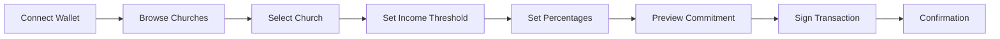
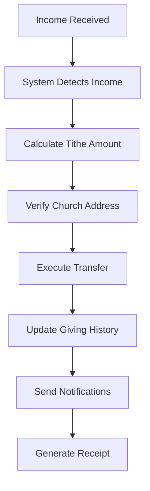
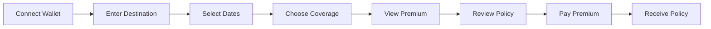
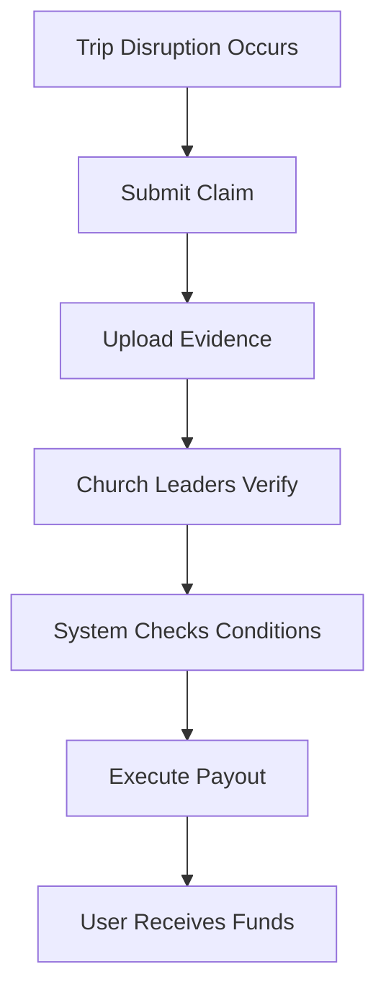
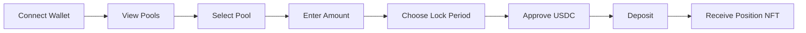

# Copilot Instructions for Steward Next.js Project

## Project Overview
- This is a Next.js (TypeScript) frontend for the Steward platform.
- Uses the App Router (`app/` directory) and is set up for wallet integration (wagmi, viem).

## Key Structure
- `app/` – Next.js app directory (routing, layouts, pages)
- `components/` – Shared React components
- `styles/` – CSS modules and global styles
- `.github/copilot-instructions.md` – AI agent guidance (this file)

## Developer Workflows
- **Install dependencies:** `npm install`
- **Run dev server:** `npm run dev`
- **Build for production:** `npm run build`
- **Wallet integration:** Use `wagmi` and `viem` for EVM wallet connections
- **Add new pages:** Place in `app/` as folders with `page.tsx`
- **Add shared UI:** Place in `components/`

## Project Conventions
- Use TypeScript for all code
- Prefer functional React components
- Use the App Router (`app/` directory) for all routing
- Use only Tailwind classes and write minimum custom CSS
- Use CSS modules or global styles in `styles/`
- Place reusable UI in `components/`
- Use `wagmi` hooks for wallet state/connection

## Integration Points
- Wallet connection logic should be placed in `components/` or a dedicated `hooks/` directory
- For blockchain interactions, use `viem` and `wagmi` together

## Examples
- To add a new page: `app/example/page.tsx`
- To add a wallet connect button: `components/WalletConnectButton.tsx`

## Additional Notes
- No backend code in this repo
- Keep README.md up to date with new workflows
- For more, see Next.js and wagmi documentation

# 🚀 Trig Protocol + Steward: Team Briefing & User Stories

**Project**: Christian Financial Stewardship Platform on Blockchain
**Duration**: 72-hour Hackathon
**Team Size**: 3 members (2 developers + 1 non-technical)
**Target**: Working demo with real-world use cases


---


## 🎯 **What Are We Building? (30-Second Pitch)**


We're building **Steward** - a blockchain platform that helps Christians practice faithful financial stewardship through automated giving, mission trip protection, and transparent church accountability. It's powered by **Trig Protocol**, which enables smart contracts that automatically execute when real-world conditions are met.


**Think of it as**: "If This, Then That" (IFTTT) for Christian giving and insurance, backed by real money from DeFi protocols.


## 📖 **Core User Stories**


### **Epic 1: Automated Tithing System**


#### **User Story 1.1: Create Tithe Commitment**
```
AS A Christian believer
I WANT TO set up automatic tithing to my church
SO THAT I can practice consistent biblical giving without manual effort
```


**Acceptance Criteria**:
- ✅ User can connect their wallet
- ✅ User can select a verified church from a list
- ✅ User can set income threshold (e.g., "$5,000/month")
- ✅ User can set tithe percentage (e.g., "10%")
- ✅ User can add additional offering percentage (e.g., "5% to missions")
- ✅ User can preview the commitment before confirming
- ✅ Transaction is recorded on blockchain
- ✅ User receives confirmation


**User Journey**:



**Example Scenario**:
> Sarah is a software engineer earning $8,000/month. She wants to tithe 10% to her local church and give an additional 5% to missions. She sets up her commitment once, and every month when her income comes in, the system automatically transfers $800 to her church and $400 to missions.


#### **User Story 1.2: Execute Tithe Payment**
```
AS A believer with a tithe commitment
I WANT my tithe to execute automatically when I receive income
SO THAT I don't forget to give and practice faithful stewardship
```


**Acceptance Criteria**:
- ✅ System monitors when user receives income
- ✅ Calculates correct tithe amount based on percentage
- ✅ Splits payment between church and missions if specified
- ✅ Executes transfer automatically
- ✅ Records transaction in giving history
- ✅ Sends notification to user and church
- ✅ Generates giving receipt


**User Journey**:



**Example Scenario**:
> Sarah receives her monthly salary on the 1st of each month. The system automatically detects this, calculates her 10% tithe ($800) and 5% offering ($400), and transfers the funds to her church and missions fund. She receives a notification with her giving receipt for tax purposes.


#### **User Story 1.3: View Giving History**
```
AS A believer who tithes
I WANT TO see my complete giving history
SO THAT I can track my stewardship and have records for tax purposes
```


**Acceptance Criteria**:
- ✅ User can view all past tithe payments
- ✅ See amounts, dates, and recipients
- ✅ View running totals (yearly, lifetime)
- ✅ Export giving statements
- ✅ See blockchain proof of each payment


**Example Scenario**:
> At tax time, Sarah needs her annual giving statement. She logs into Steward, views her complete history, and exports a report showing she gave $9,600 to church and $4,800 to missions in 2024.


---


### **Epic 2: Mission Trip Protection**


#### **User Story 2.1: Purchase Mission Protection**
```
AS A missionary preparing for international service
I WANT TO purchase insurance for my mission trip
SO THAT I'm protected if the trip is disrupted or cancelled
```


**Acceptance Criteria**:
- ✅ User can enter trip destination
- ✅ User can select trip dates
- ✅ User can choose coverage amount
- ✅ System calculates premium automatically
- ✅ User can review policy details
- ✅ User can pay premium and receive policy
- ✅ Policy is recorded on blockchain


**User Journey**:



**Example Scenario**:
> Pastor John is leading a mission trip to Kenya for 30 days. He purchases a $2,000 coverage policy for a $100 premium. If the trip is cancelled due to political unrest or his flight is significantly delayed, he automatically receives the payout.


#### **User Story 2.2: File Mission Trip Claim**
```
AS A missionary with trip protection
I WANT TO file a claim if my trip is disrupted
SO THAT I receive the protection payout automatically
```


**Acceptance Criteria**:
- ✅ User can submit claim with evidence
- ✅ System verifies the disruption occurred
- ✅ Church leaders verify the claim (2-of-3)
- ✅ Payout executes automatically upon verification
- ✅ User receives funds within 24 hours
- ✅ Transaction is recorded on blockchain


**User Journey**:



**Example Scenario**:
> Pastor John's flight to Kenya is cancelled due to political unrest. He submits a claim with his cancelled flight confirmation. Three church elders verify the situation. The smart contract automatically transfers $2,000 to Pastor John's wallet within 24 hours.


---


### **Epic 3: Church Leadership Portal**


#### **User Story 3.1: Register Church**
```
AS A church leader
I WANT TO register my church on the platform
SO THAT members can tithe to us and we can verify other leaders
```


**Acceptance Criteria**:
- ✅ Leader can enter church details (name, location, denomination)
- ✅ Leader must stake 1 ETH to register
- ✅ Church information is stored on blockchain
- ✅ Church receives unique identifier
- ✅ Church appears in member search results


**Example Scenario**:
> Pastor Mike wants his church on Steward. He connects his wallet, enters "Grace Community Church, Dallas, TX", stakes 1 ETH as security deposit, and completes registration. Now his church members can set up automatic tithing to the church.


#### **User Story 3.2: Verify Church Leader**
```
AS A verified church
I WANT TO verify other church leaders
SO THAT they can participate in claim verification
```


**Acceptance Criteria**:
- ✅ Church can nominate leaders for verification
- ✅ Leader must stake 0.1 ETH to be verified
- ✅ Leader receives verification credentials
- ✅ Leader can now verify claims and testimonies
- ✅ Leader's verification power is based on stake amount


**Example Scenario**:
> Grace Community Church verifies three of its elders. Each elder stakes 0.1 ETH. Now these elders can verify mission trip claims, tithe commitments, and other activities, providing accountability to the system.


#### **User Story 3.3: View Received Tithes**
```
AS A church leader
I WANT TO see all tithes received by our church
SO THAT we can track donations and thank our members
```


**Acceptance Criteria**:
- ✅ Church can view all received tithes
- ✅ See donor information (with privacy options)
- ✅ View amounts and dates
- ✅ Export financial reports
- ✅ See total received (monthly, yearly)


**Example Scenario**:
> At the end of the month, Pastor Mike logs in and sees that 25 members gave a total of $15,000 in tithes. He can see individual contributions (if members haven't chosen to remain anonymous) and send thank-you messages.


---


### **Epic 4: DeFi Capital Backing**


#### **User Story 4.1: Provide Backing Capital**
```
AS A DeFi user with idle USDC
I WANT TO back insurance policies to earn yield
SO THAT my capital is productive and I earn higher returns
```


**Acceptance Criteria**:
- ✅ User can view available backing pools
- ✅ User can see current APY rates
- ✅ User can deposit USDC into pool
- ✅ User can choose lock period
- ✅ User receives position confirmation
- ✅ User can track yield earnings


**User Journey**:



**Example Scenario**:
> Maria has $50,000 USDC sitting idle in Morpho earning 5% APY. She moves it to Steward's backing pool where she earns 12% APY (5% base + 7% from insurance premiums). Her capital backs mission trip insurance policies.


#### **User Story 4.2: Withdraw Backing**
```
AS A capital provider
I WANT TO withdraw my backing when the lock period ends
SO THAT I can access my capital and earned yield
```


**Acceptance Criteria**:
- ✅ User can view their positions
- ✅ System shows lock period remaining
- ✅ User can withdraw after lock expires
- ✅ Withdrawal includes principal + yield
- ✅ Transaction completes within minutes
- ✅ Position is marked as closed


**Example Scenario**:
> After 6 months, Maria's lock period expires. She logs in, sees she earned $6,000 in yield (12% APY), and withdraws her $56,000 total back to her wallet.
