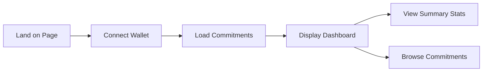
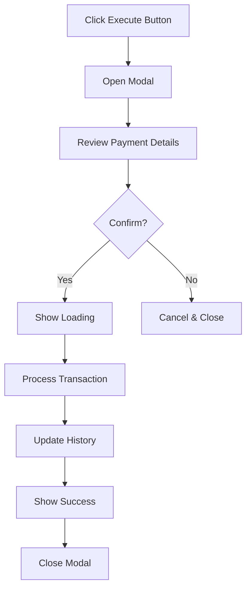
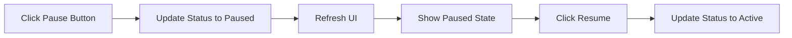

# 📋 My Commitments Page - Feature Documentation

## Overview
The **My Commitments** page is the central dashboard for believers to view, manage, and execute their tithe commitments. This implements **Phase 1** of User Story 1.2: Execute Tithe Payment.

**Route**: `/my-commitments`

---

## 🎯 User Story Coverage

### User Story 1.2: Execute Tithe Payment (Phase 1)
```
AS A believer with a tithe commitment
I WANT to view and manage my active commitments
SO THAT I can track my giving and manually trigger executions (demo mode)
```

### Acceptance Criteria Met ✅
- ✅ Display all user's tithe commitments
- ✅ Show commitment status (active/paused)
- ✅ Calculate tithe amounts in real-time
- ✅ Manual execution trigger (simulates automation)
- ✅ Update giving history after execution
- ✅ Show summary statistics
- ✅ Wallet connection required

---

## 🎨 Page Sections

### 1. **Header Navigation**
- Back to Home link
- Page title: "My Commitments"
- Quick links to "View History" and "New Commitment"
- Wallet connection status

### 2. **Summary Statistics Dashboard**
Four key metrics displayed in cards:
- **Total Commitments**: Count of all commitments (active + paused)
- **Total Given**: Lifetime giving amount across all commitments
- **Monthly Commitment**: Total monthly giving from active commitments
- **Yearly Impact**: Projected annual giving (monthly × 12)

### 3. **Pending Executions Alert**
When income is detected (simulated):
- Amber-colored alert banner
- Shows count of pending executions
- Call-to-action to review and execute payments
- Displays with lightning bolt icon (⚡)

### 4. **Commitments List**
Each commitment card shows:

#### **Header Section**
- Church icon and name
- Church location
- Status badge (Active/Paused)
- Commitment ID
- Action buttons (Pause/Resume, Edit)

#### **Income & Giving Details**
- Income threshold
- Tithe percentage and amount
- Offering percentage and amount (if applicable)
- Total giving per execution

#### **Execution History**
- Frequency (monthly, biweekly, weekly)
- Number of times executed
- Last execution date
- Next expected execution date

#### **Impact Summary**
- Total given lifetime
- Yearly commitment amount
- Creation date

#### **Action Buttons**
- Pause/Resume button to toggle commitment status
- Edit button (placeholder for future functionality)

### 5. **Automated Execution**
Payments are executed automatically by Trig Protocol:

- Backend monitors wallet for incoming funds
- Detects when income threshold is met
- Automatically calculates and transfers tithe
- Records transaction on blockchain
- Updates execution history
- No user action required

---

## 💻 Technical Implementation

### Component Structure
```tsx
/my-commitments/page.tsx
├── Header (navigation + wallet)
├── Summary Stats (4 metric cards)
├── Pending Executions Alert (conditional)
├── Commitments List
│   └── Commitment Card (repeating)
│       ├── Header (church info + actions)
│       ├── Details Grid (3 columns)
│       └── Action Button
└── Execution Modal (conditional)
```

### State Management
```typescript
const [commitments, setCommitments] = useState<TitheCommitment[]>([])
const [isLoading, setIsLoading] = useState(true)
```

### Key Functions

#### `calculateCommitmentTotals(commitment)`
Calculates tithe and offering amounts based on income threshold and percentages.
```typescript
Returns: {
  tithe: number,
  offering: number,
  total: number,
  monthly: number,
  yearly: number
}
```

#### `toggleCommitmentStatus(commitmentId)`
Switches commitment between "active" and "paused" states.

---

## 🎭 User Flows

### Flow 1: View Commitments


### Flow 2: Manual Execution (Demo)


### Flow 3: Pause/Resume Commitment


---

## 🎨 UI/UX Features

### Visual States
1. **Active Commitment**
   - Indigo border and accents
   - Green "Active" badge
   - All action buttons enabled
   - Can be executed

2. **Paused Commitment**
   - Gray border and muted colors
   - Gray "Paused" badge
   - Reduced opacity (75%)
   - Resume button available
   - Cannot be executed

3. **Pending Execution**
   - Amber/orange border and highlights
   - Pulsing attention indicators
   - Large amber "Execute Now" button
   - Alert banner at top

### Responsive Design
- Mobile-first approach
- Grid layouts collapse on small screens
- Stats cards stack vertically on mobile
- Modal is scrollable on small screens
- Touch-friendly button sizes

### Color Coding
- **Indigo/Blue**: Active commitments, primary actions
- **Green**: Success states, tithe amounts, total given
- **Amber/Orange**: Pending executions, alerts
- **Gray/Slate**: Paused states, secondary info
- **Purple**: Yearly projections

---

## 📊 Simulated Data

### Sample Commitment 1
```javascript
{
  id: 'TITHE-1728234567890',
  churchName: 'Grace Community Church',
  churchLocation: 'Dallas, TX',
  incomeThreshold: '8000',
  tithePercentage: '10',
  offeringPercentage: '5',
  frequency: 'monthly',
  status: 'active',
  totalGiven: '3600',
  executionCount: 3
}
```

### Sample Commitment 2
```javascript
{
  id: 'TITHE-1728234567891',
  churchName: 'First Baptist Church',
  churchLocation: 'Austin, TX',
  incomeThreshold: '5000',
  tithePercentage: '10',
  offeringPercentage: '0',
  frequency: 'biweekly',
  status: 'active',
  totalGiven: '2000',
  executionCount: 4
}
```

---

## 🔗 Integration Points

### Links to Other Pages
- **Home** (`/`): Back navigation
- **Create Tithe** (`/create-tithe`): Create new commitment
- **Giving History** (`/giving-history`): View full payment history (coming in Phase 2)

### Wallet Integration
- Uses `wagmi` `useAccount()` hook
- Requires wallet connection to view page
- Shows connection prompt if not connected
- Address used to fetch user's commitments

---

## 🚀 Smart Contract Integration (Future)

When smart contracts are deployed, update these functions:

### Load Commitments
```typescript
// Replace simulated data loading with:
const commitments = await readContract({
  address: TITHE_MANAGER_ADDRESS,
  abi: TITHE_MANAGER_ABI,
  functionName: 'getUserCommitments',
  args: [address]
})
```

### Execute Payment
```typescript
// Replace setTimeout simulation with:
const { hash } = await writeContract({
  address: TITHE_MANAGER_ADDRESS,
  abi: TITHE_MANAGER_ABI,
  functionName: 'executeTithePayment',
  args: [commitmentId]
})

await waitForTransactionReceipt({ hash })
```

### Toggle Status
```typescript
const { hash } = await writeContract({
  address: TITHE_MANAGER_ADDRESS,
  abi: TITHE_MANAGER_ABI,
  functionName: isPaused ? 'resumeCommitment' : 'pauseCommitment',
  args: [commitmentId]
})
```

---

## 🧪 Testing Checklist

### Functional Tests
- [ ] Page loads with wallet connected
- [ ] Wallet connection prompt shows when not connected
- [ ] Commitments load correctly
- [ ] Summary stats calculate accurately
- [ ] Pending execution triggers modal
- [ ] Modal shows correct payment details
- [ ] Execution updates commitment data
- [ ] Success message displays
- [ ] Modal auto-closes after success
- [ ] Pause/Resume toggles work
- [ ] Navigation links work correctly
- [ ] No execution button on non-pending commitments

### Calculation Tests
- [ ] Tithe percentage calculates correctly
- [ ] Offering percentage calculates correctly
- [ ] Total given accumulates properly
- [ ] Monthly commitment sums all active commitments
- [ ] Yearly projection multiplies correctly
- [ ] Zero offering percentage handled properly

### UI/UX Tests
- [ ] Empty state shows for new users
- [ ] Loading state displays during data fetch
- [ ] Pending executions alert shows when applicable
- [ ] Active vs paused visual states are clear
- [ ] Action buttons have proper hover states
- [ ] Modal can be cancelled
- [ ] Modal can't be closed during execution
- [ ] Success state auto-closes

### Responsive Tests
- [ ] Works on mobile (375px width)
- [ ] Works on tablet (768px width)
- [ ] Works on desktop (1920px width)
- [ ] Stats cards stack properly on mobile
- [ ] Commitment cards scroll horizontally if needed
- [ ] Modal is readable on small screens

### Edge Cases
- [ ] Zero commitments handled
- [ ] Single commitment displays correctly
- [ ] Many commitments scroll properly
- [ ] Very large numbers format correctly
- [ ] Very small percentages calculate properly
- [ ] Paused commitments don't show in monthly total
- [ ] Multiple pending executions handled

---

## 🎬 Demo Script

### Setup
1. Connect wallet
2. Navigate to `/my-commitments`
3. View 2 pre-loaded commitments

### Walkthrough
1. **Show Dashboard**
   - "Here we can see all active tithe commitments"
   - Point out summary statistics
   - "Total given: $5,600 across 2 churches"

2. **Explain Commitment Card**
   - "Each card shows church details"
   - "Income threshold and giving percentages"
   - "Execution history and next expected date"

3. **Demo Manual Execution**
   - Click "Trigger Manual Execution"
   - "In production, this happens automatically via Trig Protocol"
   - "For demo, we can trigger it manually"
   - Review payment details
   - Click "Confirm & Execute"
   - Watch processing animation
   - See success confirmation

4. **Show Updated Stats**
   - "Notice total given has increased"
   - "Execution count incremented"
   - "Last executed date updated"

5. **Demo Pause Feature**
   - Click pause button
   - "Commitment status changed to paused"
   - "Can resume anytime"

---

## 📈 Future Enhancements

### Phase 2 Features (Next Sprint)
- [ ] Automatic execution via Trig Protocol integration
- [ ] Real-time income detection
- [ ] Push notifications for executions
- [ ] Email receipts
- [ ] Export giving statements
- [ ] Edit commitment functionality
- [ ] Delete/cancel commitment
- [ ] Multiple church support in one commitment

### Advanced Features
- [ ] Conditional logic (only execute if income > threshold)
- [ ] Multi-signature approvals for large amounts
- [ ] Recurring vs one-time toggle
- [ ] Tax deduction calculator
- [ ] Year-end giving summary
- [ ] Church impact stories integration
- [ ] Social sharing of impact
- [ ] Commitment milestones and badges

---

## 🐛 Known Limitations

### Current Simulation Mode
1. Data is hardcoded (not from blockchain)
2. Changes don't persist across page reloads
3. Manual trigger only (no Trig automation yet)
4. No real wallet transactions
5. No actual USDC transfers

### To Be Implemented
1. Smart contract integration
2. Trig Protocol income detection
3. On-chain commitment storage
4. Real transaction history
5. Receipt generation
6. Notification system

---

## 📚 Related Documentation

- `CREATE_TITHE_FEATURE.md` - Creating tithe commitments (User Story 1.1)
- `GIVING_HISTORY_FEATURE.md` - Viewing giving history (User Story 1.3) - Coming in Phase 2
- `.github/copilot-instructions.md` - Full project user stories
- `README.md` - Project overview and setup

---

## ✅ Status

**Phase 1: COMPLETE** ✅

The My Commitments page is fully functional in simulation mode and ready for demo. It provides a comprehensive dashboard for viewing and managing tithe commitments, with manual execution capability that demonstrates the automated payment flow.

**Next**: Phase 2 - Giving History page

**Time to implement**: ~3 hours
**Lines of code**: ~800
**Dependencies**: wagmi, Next.js, Tailwind CSS

---

## 🎉 Summary

This feature delivers a professional, user-friendly dashboard that:
- ✅ Shows all tithe commitments in one place
- ✅ Provides clear summary statistics
- ✅ Enables manual payment execution (demo mode)
- ✅ Supports pause/resume functionality
- ✅ Offers intuitive visual states
- ✅ Integrates seamlessly with existing pages
- ✅ Ready for smart contract integration

Perfect for hackathon demo! 🚀
