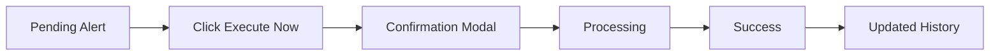

# 🔧 My Commitments Page - Updates

## Changes Made

### ✅ Removed Features

1. **Manual Execution Demo Button**
   - Removed "Trigger Manual Execution (Demo)" button
   - Removed the blue indigo button shown on non-pending commitments
   - Simplified the action button logic

2. **Eye Icon Button**
   - Removed the eye icon button from commitment cards
   - Removed the link to `/giving-history?commitment={id}`
   - Simplified action button group to only Pause/Resume and Edit

3. **Related Code Cleanup**
   - Removed `handleManualExecution()` function (no longer needed)
   - Removed `RefreshCw` icon import
   - Removed `Eye` icon import

### ✅ What Remains

**Execution Flow:**
- Only **pending executions** show the execution button
- "Execute Tithe Payment Now" button (amber gradient)
- Opens modal for confirmation
- Same 3-step execution flow (confirm → processing → success)

**Action Buttons:**
- ⏸️/▶️ **Pause/Resume** - Toggle commitment status
- ✏️ **Edit** - Edit commitment (placeholder)

**Visual States:**
- Active commitments (indigo border)
- Paused commitments (gray, 75% opacity)
- Pending executions (amber border with alert)

---

## Current Button Behavior

### Active Commitment (No Pending)
```
┌─────────────────────────────────────────┐
│  Church Card                            │
│  [⏸️ Pause] [✏️ Edit]                   │
│                                         │
│  [No execution button shown]            │
└─────────────────────────────────────────┘
```

### Pending Execution
```
┌─────────────────────────────────────────┐
│  Church Card (Amber Border)             │
│  [⏸️ Pause] [✏️ Edit]                   │
│                                         │
│  [⚡ Execute Tithe Payment Now]         │
└─────────────────────────────────────────┘
```

### Paused Commitment
```
┌─────────────────────────────────────────┐
│  Church Card (Gray, Muted)              │
│  [▶️ Resume] [✏️ Edit]                  │
│                                         │
│  [No execution button shown]            │
└─────────────────────────────────────────┘
```

---

## Execution Flow (Simplified)



**No manual demo trigger** - Only shows for actual pending executions!

---

## Demo Impact

### Before (Confusing)
- Two execution buttons: "Execute Now" + "Trigger Demo"
- Demo button on every active card
- Eye button linking to non-existent page

### After (Cleaner)
- Single execution button only when needed
- Clearer purpose: "Execute Now" for pending only
- Simpler action button group
- More focused, less cluttered

---

## What to Demo

1. **Show Pending Execution**
   - Point out amber alert banner
   - Highlight pending commitment with amber border
   - Click "Execute Tithe Payment Now"

2. **Show Execution Modal**
   - Review payment details
   - Confirm execution
   - Watch processing
   - See success confirmation

3. **Show Management**
   - Pause/Resume functionality
   - Edit button (placeholder)

**Note**: No more confusing "demo trigger" on non-pending commitments!

---

## Files Updated

1. ✅ `src/app/my-commitments/page.tsx`
   - Removed `handleManualExecution()` function
   - Removed manual demo button
   - Removed eye icon button
   - Removed unused icon imports
   - Simplified execution button logic

**Lines Removed**: ~40 lines  
**Complexity Reduced**: Simpler, clearer UX

---

## ✨ Result

**Cleaner, more focused dashboard** that only shows execution buttons when there's an actual pending payment to execute. The UX is now more straightforward and less confusing for users.

Perfect for demo! 🚀
